# blockvrock_doc

# このドキュメントについて
このドキュメントはblockVlockのそれぞれのブロックについての説明と使用例を示しています。
# 目次

## シーン(ピンク)のブロックについて
[シーンスタート](./pinkblock/scenestart.md)

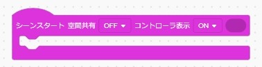

[ARシーン](./pinkblock/arscene.md)

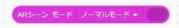

[コンソールを表示する](./pinkblock/previewconsole.md)

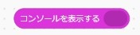

## 物理(赤)のブロックについて

[直方体](./redblock/rectangular.md)

[球体](./redblock/sphere.md)

[半角英数字ひらがなカタカナ](./redblock/character.md)

[カメラ](./redblock/camera.md)

[グループ](./redblock/group.md)

## 属性(青)のブロックについてい

[常に直進](./blueblock/alwaysstraight.md)

[常に回転](./blueblock/alwaysturn.md)

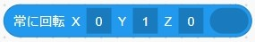

[見つめる](./blueblock/stare.md)

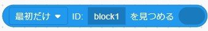

[ID](./blueblock/id.md)

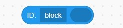

[位置](./blueblock/alwaysstraight.md)

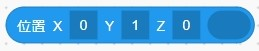

[回転](./blueblock/turn.md)

[大きさ](./blueblock/size.md)

[チェックポイント](./blueblock/checkpoint.md)

[透明度](./blueblock/transparency.md)

[クラス](./blueblock/class.md)

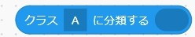

[色](./blueblock/color.md)

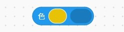

[殴る](./blueblock/strike.md)

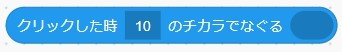

[ランダムな位置](./blueblock/randposition.md)

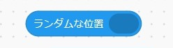

[ランダムな大きさ](./blueblock/randsize.md)

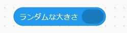

[ランダムな色](./blueblock/randcolor.md)

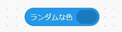

[向きを同期する](./blueblock/syncdirection.md)

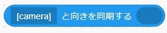

[リードする](./blueblock/leaddistance.md)

[ネットワーク共有](./blueblock/sharenetwork.md)

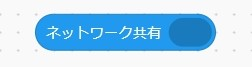

## 環境(緑)のブロックについて

[背景](./greenblock/environment.md)

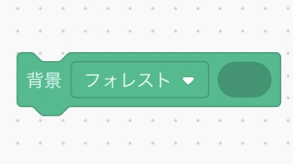

[全天球](./greenblock/panoramicsphere.md)

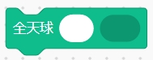

[ライト](./greenblock/light.md)

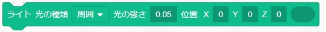

## 物理エンジン(紺色)のブロックについて

[動く](./darkblueblock/move.md)

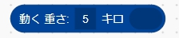

[動かない](./darkblueblock/dontmove.md)

[ID「block」がぶつかった時に、相手のIDを「target」にセット](./darkblueblock/idset.md)

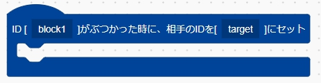

## AR(紫色)のブロックについて

[ARマーカー](./purpleblock/ARmarker.md)

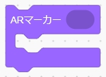

[Hiroマーカー](./purpleblock/Hiromarker.md)

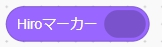

[QRマーカー](./purpleblock/QRmarker.md)

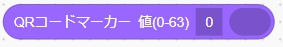

## 制御(黄色)のブロックについて

[変数「X」をカウントして「＊」から「＊」まで繰り返す](./yellowblock/countandloop.md)

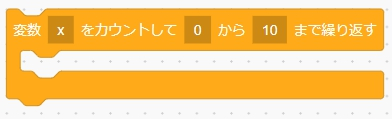

[変数「X」に、配列「list」からデータを取り出して繰り返す](./yellowblock/pickdata.md)

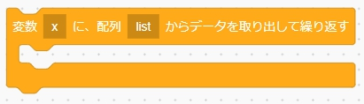

[もし「＊」なら](./yellowblock/if.md)

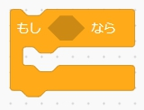

[もし「＊」なら「＊」でなければ](./yellowblock/ifelse.md)

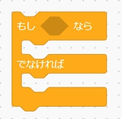

[変数「＊」に値「数値や文字」をセット](./yellowblock/setvalueorchara.md)

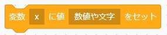

[配列「list」にカンマ区切りの複数の値「1,2,3,4」をセット](./yellowblock/listsetvalue.md)

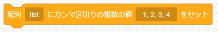

[ブロック「id」を「＊」に変更](./yellowblock/rename.md)

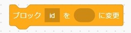

[コメントアウト](./yellowblock/commentout.md)

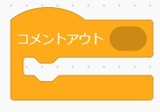

## 演算のブロックについて

[<10 = 10>](./calculateblock/equal.md)

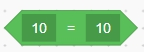

[<10 > 10>](./calculateblock/greaterthan.md)

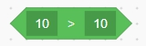

[<10 < 10>](./calculateblock/lessthan.md)

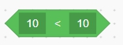

[<* かつ *>](./calculateblock/and.md)

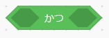

[<* または *>](./calculateblock/or.md)

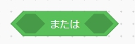

[<ではない>](./calculateblock/not.md)

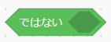

## ブロック定義のブロックについて

[ブロック「ブロック名」を、パラメータ「＊」を受け付けるように定義](./definitionblock/definitionreceive.md)

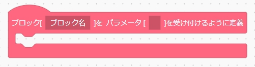

[ブロック「ブロック名」にパラメータ「＊」を引き渡して呼び出し](./definitionblock/definitiongive.md)

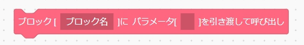

[初期処理](./definitionblock/initialprocess.md)

[クリックした時に「ブロック名」を処理する](./definitionblock/clickprocess.md)

Author:　波多野遊然
