# blockvrock_doc

# このドキュメントについて

このドキュメントは blockVlock のそれぞれのブロックについての説明と使用例を示しています。

# 目次

## シーン(ピンク)のブロックについて

[シーンスタート](./blocks/pinkblock/scenestart.md)

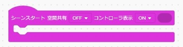

[AR シーン](./blocks/pinkblock/arscene.md)

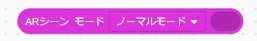

[コンソールを表示する](./blocks/pinkblock/previewconsole.md)

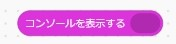

## 物理(赤)のブロックについて

[直方体](./blocks/redblock/rectangular.md)

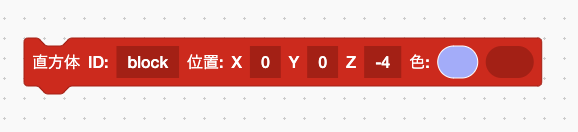

[球体](./blocks/redblock/sphere.md)

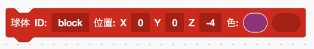

[半角英数字ひらがなカタカナ](./blocks/redblock/character.md)

[カメラ](./blocks/redblock/camera.md)

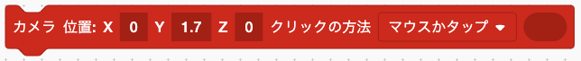

[グループ](./blocks/redblock/group.md)

## 属性(青)のブロックについてい

[常に直進](./blocks/blueblock/alwaysstraight.md)

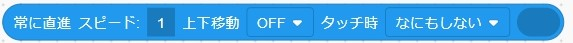

[常に回転](./blocks/blueblock/alwaysturn.md)

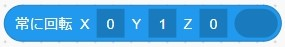

[見つめる](./blocks/blueblock/stare.md)

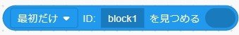

[ID](./blocks/blueblock/id.md)

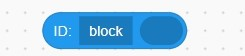

[位置](./blocks/blueblock/position.md)

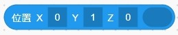

[回転](./blocks/blueblock/turn.md)

[大きさ](./blocks/blueblock/size.md)

  
未整理

    

[チェックポイント](./blocks/blueblock/checkpoint.md)

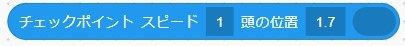

[透明度](./blocks/blueblock/transparency.md)

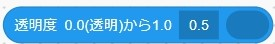

[クラス](./blocks/blueblock/class.md)

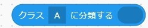

[色](./blocks/blueblock/color.md)

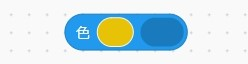

[殴る](./blocks/blueblock/strike.md)

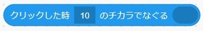

[ランダムな位置](./blocks/blueblock/randposition.md)

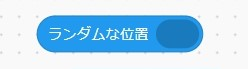

[ランダムな大きさ](./blocks/blueblock/randsize.md)

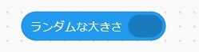

[ランダムな色](./blocks/blueblock/randcolor.md)

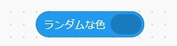

[向きを同期する](./blocks/blueblock/syncdirection.md)

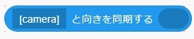

[リードする](./blocks/blueblock/leaddistance.md)

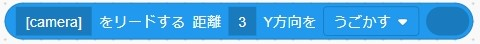

[ネットワーク共有](./blocks/blueblock/sharenetwork.md)

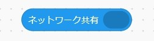

  

## 環境(緑)のブロックについて

[背景](./blocks/greenblock/environment.md)

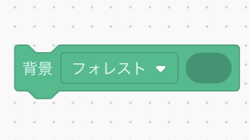

  
未整理

    

[全天球](./blocks/greenblock/panoramicsphere.md)

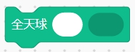

[ライト](./blocks/greenblock/light.md)

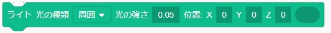

## 物理エンジン(紺色)のブロックについて

[動く](./blocks/darkblueblock/move.md)

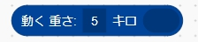

[動かない](./blocks/darkblueblock/dontmove.md)

[ID「block」がぶつかった時に、相手の ID を「target」にセット](./blocks/darkblueblock/idset.md)

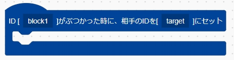

## AR(紫色)のブロックについて

[AR マーカー](./blocks/purpleblock/ARmarker.md)

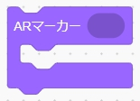

[Hiro マーカー](./blocks/purpleblock/Hiromarker.md)

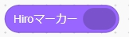

[QR マーカー](./blocks/purpleblock/QRmarker.md)

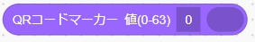

## 制御(黄色)のブロックについて

[変数「X」をカウントして「＊」から「＊」まで繰り返す](./blocks/yellowblock/countandloop.md)

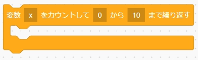

[変数「X」に、配列「list」からデータを取り出して繰り返す](./blocks/yellowblock/pickdata.md)

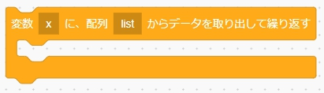

[もし「＊」なら](./blocks/yellowblock/if.md)

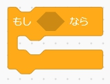

[もし「＊」なら「＊」でなければ](./blocks/yellowblock/ifelse.md)

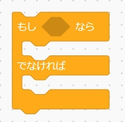

[変数「＊」に値「数値や文字」をセット](./blocks/yellowblock/setvalueorchara.md)

[配列「list」にカンマ区切りの複数の値「1,2,3,4」をセット](./blocks/yellowblock/listsetvalue.md)

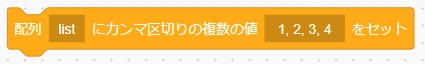

[ブロック「id」を「＊」に変更](./blocks/yellowblock/rename.md)

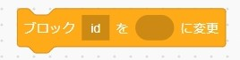

[コメントアウト](./blocks/yellowblock/commentout.md)

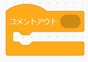

## 演算のブロックについて

[<10 = 10>](./blocks/calculateblock/equal.md)

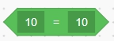

[<10 > 10>](./blocks/calculateblock/greaterthan.md)

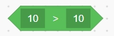

[<10 < 10>](./blocks/calculateblock/lessthan.md)

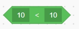

[<_ かつ _>](./blocks/calculateblock/and.md)

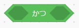

[<_ または _>](./blocks/calculateblock/or.md)

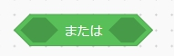

[<ではない>](./blocks/calculateblock/not.md)

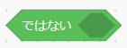

## ブロック定義のブロックについて

[ブロック「ブロック名」を、パラメータ「＊」を受け付けるように定義](./blocks/definitionblock/definitionreceive.md)

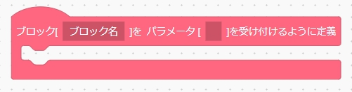

[ブロック「ブロック名」にパラメータ「＊」を引き渡して呼び出し](./blocks/definitionblock/definitiongive.md)

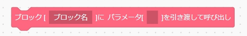

[初期処理](./blocks/definitionblock/initialprocess.md)

[クリックした時に「ブロック名」を処理する](./blocks/definitionblock/clickprocess.md)

## クラスルーム機能について（[有料]スクールアカウント専用)
[クラスルームとは](./class_room/classroom01.md)

Author:　波多野遊然
