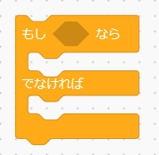

# もし＊なら＊でなければ＊ブロックに関する記述です

## 機能説明
*のひし形の枠の演算内容が正しい時に設定せされているブロック処理をします
演算内容が正しくない時は、でなければの方の設定されているブロックの処理をします

## オプション
条件判定の演算の設定を変更できます  

## 組み合わせブロック
演算ブロック：条件を変更できます  

## 使用例
もし5が10より小さいが成り立つならば直方体を生成する、成り立たないならば球体を生成する  

